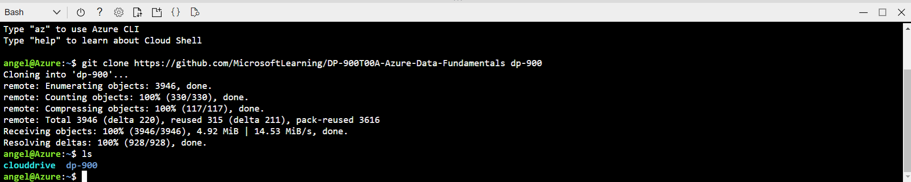
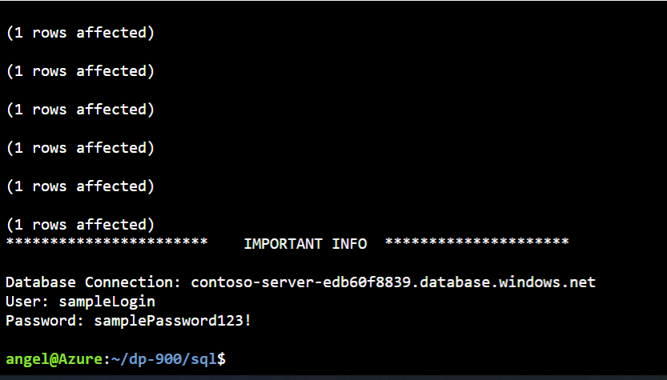
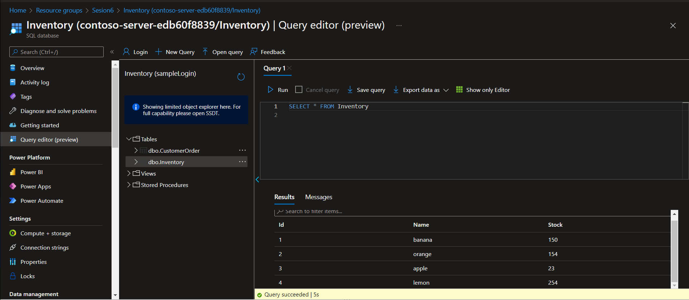
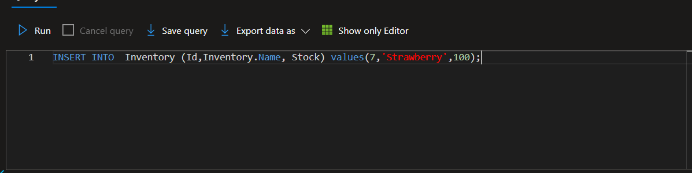
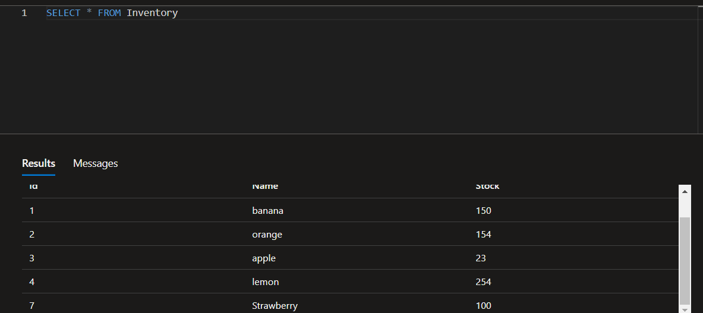

# Como hacer una Base de Datos SQL
Primero debemos tener dos pestañas abiertas las cuales son 
- [Portal azure](https://portal.azure.com/#home) 
- [GitHub](https://github.com/josejesusguzman/acordeon-az900-innovaccion/blob/main/res/consultas-sql.md)

Copiaremos el link 
" git clone https://github.com/MicrosoftLearning/DP-900T00A-Azure-Data-Fundamentals dp-900 " y lo ejecutaremos en nuestro almacenamiento de Azure, despues escribimos "ls" y ejecutamos despues escribiremos:
" cd dp-900/sql " y de igual manera ejecutaremos: 

Por ultimo escribir " bash setup.sh " ejecutamos y esperamos a que Azure nos registre
 
Una ves ejecutado nos iremos al grupo de recursos que el programa que ejecutamos previamente creo y abriremos la base de datos y nos dirigeremos a "Establecer firewall de servidor" y agregaremos nuestra direccion IP
Ahora nos dirigiremosal apartado "Editor de consultas" e iniciaremos sesion con los datos que nos arrojo nuestra terminal cuando ejecutamos los comandos previamente
Cuando ingrese podremos iniciar a agregar o eliminar cosas con SQL

Y listo agregamos cosas a la lista con nombre "Inventory"

